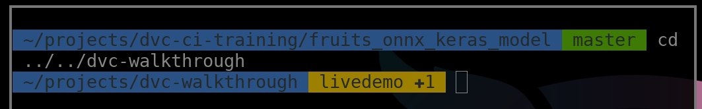

This is a quick and dirty mashup of https://github.com/fletom/agnoster-no-powerline-zsh-theme and https://github.com/olivierverdier/zsh-git-prompt.

To install, simply copy all files (except .md) into your oh-my-zsh installation's theme folder and reference the theme in your `~/.zshrc`.

See screenshot for example of a clean master and another project's branch with one changed file.

